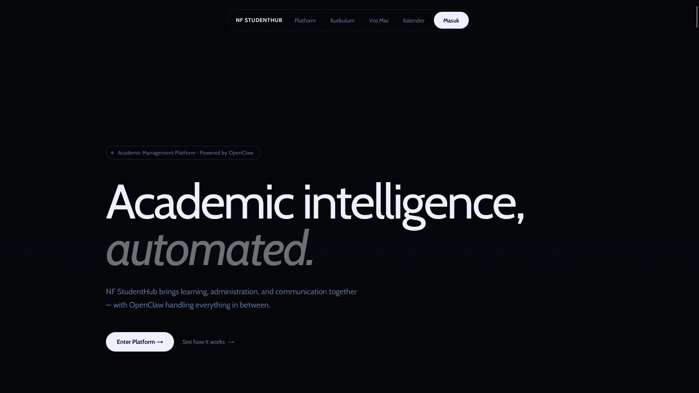
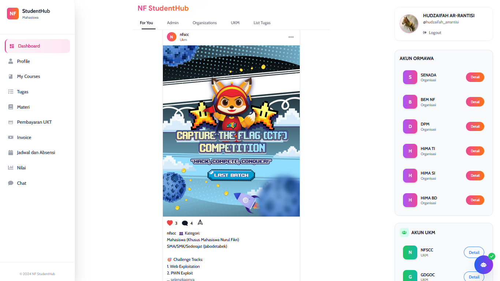

# 🎓 NF StudentHub




*Landing Page NF StudentHub - hero utama platform akademik terintegrasi.*



*Dashboard Mahasiswa - pengalaman feed ala Instagram (For You, like, komentar, posting organisasi) yang digabung dengan fitur akademik seperti tugas, materi, absensi, nilai, dan pembayaran UKT.*


NF StudentHub adalah platform digital terintegrasi untuk ekosistem akademik STT Nurul Fikri, yang menghubungkan Mahasiswa, Dosen, Admin, Orang Tua, UKM, dan ORMAWA dalam satu sistem web yang modern, aman, dan scalable.

Secara pengalaman pengguna, NF StudentHub mengadopsi pola interaksi modern yang familiar seperti Instagram (timeline feed, interaksi sosial, dan update komunitas), lalu menggabungkannya dengan kebutuhan inti kampus dalam satu aplikasi (LMS + administrasi + komunikasi real-time).

> One platform. One ecosystem. One academic experience.

## 📌 Gambaran Umum

NF StudentHub dirancang sebagai one-stop academic platform untuk memusatkan layanan kampus:
- Manajemen akademik (mata kuliah, pertemuan, nilai)
- Sistem pembayaran UKT dengan invoice & status
- Absensi berbasis QR (dosen dan mahasiswa)
- Komunikasi real-time via WebSocket
- Media informasi kampus (feed ala sosial media)
- **Sistem Pengingat Otomatis (OpenClaw Automation Engine)** via Telegram

Sistem berbasis role memastikan setiap pengguna hanya mengakses fitur sesuai perannya.

### 🎨 Gaya Produk (Mirip Instagram, Fokus Akademik)

- Feed utama menggunakan pola social timeline agar informasi kampus lebih cepat tersampaikan.
- Interaksi seperti like, komentar, dan update organisasi membuat platform terasa hidup seperti social app modern.
- Navigasi tetap berorientasi akademik: tugas, materi, absensi, nilai, pembayaran UKT, dan komunikasi dosen-mahasiswa.
- Hasilnya: bukan sekadar LMS biasa, tapi ekosistem digital kampus yang terasa familiar, engaging, dan produktif.

---

## ✨ Fitur Utama

### 🎓 Mahasiswa
- Dashboard akademik (nilai & kehadiran)
- Akses materi dan tugas per mata kuliah
- Pembayaran UKT & tracking invoice
- Transkrip nilai & IPK
- Scan absensi QR Code
- Chat & notifikasi real-time
- Profil publik mahasiswa

### 👨‍🏫 Dosen
- Kelola mata kuliah & pertemuan
- Upload materi & tugas (terintegrasi *auto-reminder* Telegram)
- Input nilai mahasiswa
- Generate QR absensi
- Komunikasi dengan mahasiswa

### 🤖 OpenClaw (Automation Engine)
- Menarik dan memantau tugas/materi dari MySQL (Outbox Pattern & Direct Query)
- Menyebarkan notifikasi *real-time* ke bot Telegram
- Pengingat *deadline* (tenggat waktu) tugas secara otomatis

### 🛠️ Admin
- Manajemen akun pengguna
- Posting pengumuman kampus
- Monitoring pembayaran UKT
- Pengaturan sistem
- Dashboard analytics

### 👨‍👩‍👧 Orang Tua
- Monitoring kehadiran mahasiswa
- Akses status pembayaran UKT
- Notifikasi real-time
- Akses profil akademik anak

### 🏫 UKM & ORMAWA
- Posting kegiatan & pengumuman
- Kelola profil organisasi
- Interaksi sosial (like & komentar)
- Dashboard organisasi

---


## 🛠️ Teknologi

### Frontend
- React 19
- Vite 7
- Tailwind CSS
- React Router 7
- TanStack React Query 5
- Axios
- GSAP
- Three.js
- MUI + Emotion
- React Icons / Lucide

### Backend & Automation
- Go 1.24
- Gin (HTTP framework)
- GORM + MySQL
- JWT Authentication (HS256)
- Gorilla/WebSocket (real-time chat)
- godotenv (env loader)
- **OpenClaw Automation Engine**: Microservice mandiri untuk notifikasi background via **Telegram Bot API**

---

## 🚀 Instalasi

### Prasyarat
- Node.js ≥ 18
- Go ≥ 1.20 (disarankan 1.24)
- MySQL 5.7/8.0
- npm (atau yarn/pnpm)

### Clone & Setup
```bash
git clone https://github.com/HudzaifahArrantisi/NF-STUDENT-HUB.git
cd NF-Student-HUB

# Frontend
cd frontend
npm install

# Backend
cd ../backend
go mod download

# OpenClaw (Automation Engine)
cd openclaw
go mod download
cd ..
```

---

## ⚙️ Konfigurasi

### Backend (.env)
Buat file `.env` di folder backend dan isi minimal:
```env
# Koneksi database (contoh lokal)
DB_DSN=root:@tcp(127.0.0.1:3306)/nf_student_hub3?parseTime=true

# JWT
JWT_SECRET=ubah_ini_dengan_secret_yang_kuat

# Banner ASCII opsional
NAMA=NF StudentHub

# Konfigurasi OpenClaw (Opsional - default: localhost:9090)
OPENCLAW_BASE_URL=http://localhost:9090

# Konfigurasi Telegram Bot (Untuk OpenClaw)
TELEGRAM_BOT_TOKEN=token_bot_telegram_anda
TELEGRAM_CHANNEL_ID=@tugasreminder_channel_atau_group_id
```

Catatan:
- Jika `DB_DSN` kosong, backend memakai default: `root:@tcp(127.0.0.1:3306)/nf_student_hub3?parseTime=true`.
- Direktori upload otomatis dibuat: `uploads/posts`, `uploads/materi`, `uploads/tugas`, `uploads/tugasdosen`, `uploads/profile`.
- Static file dapat diakses melalui `/uploads/...` (misal: `http://localhost:8080/uploads/materi/...`).

### Frontend
- Base API default otomatis mengikuti host browser: `http://<host-aktif>:8080`.
- Opsional override via `.env.local`: `VITE_API_BASE_URL=http://<host-backend>:8080` (atau domain production).
- Dev server Vite berjalan di port `3000` dan listen ke semua interface LAN.

### CORS
- Backend menggunakan konfigurasi CORS yang mengizinkan origin dinamis saat development.
- Konfigurasi ada di backend (gin-contrib/cors) pada [backend/main.go](backend/main.go).

### Akses Local Network (LAN)
1. Jalankan frontend dan backend pada mesin yang sama.
2. Pastikan device client (HP/laptop lain) berada di jaringan Wi-Fi/LAN yang sama.
3. Akses frontend dari device lain dengan format:
	- `http://<IP-LAN-MESIN-ANDA>:3000`
4. Backend akan otomatis diakses dari host yang sama pada port `8080`.
5. Jika tidak bisa diakses dari device lain, buka Windows Firewall inbound untuk port `3000`, `8080`, dan (opsional OpenClaw) `9090`.

---

## ▶️ Menjalankan Aplikasi

### Development
```bash
# Terminal 1 (Frontend)
cd frontend
npm run dev
# Akses lokal: http://localhost:3000
# Akses LAN:   http://<IP-LAN-MESIN-ANDA>:3000

# Terminal 2 (Backend UTama)
cd backend
go run main.go
# API lokal: http://localhost:8080
# API LAN:   http://<IP-LAN-MESIN-ANDA>:8080

# Terminal 3 (OpenClaw Service)
cd backend/openclaw
go run main.go
# OpenClaw Internal API: http://localhost:9090
```

### Production (Windows)
```bash
# Build frontend
cd frontend
npm run build

# Build backend
cd ../backend
go build -o nf-student-hub.exe
./nf-student-hub.exe
```

---

## 📁 Struktur Proyek

```
NF-Student-HUB/
├── frontend/
│   ├── public/
│   └── src/
│       ├── components/
│       ├── pages/
│       ├── hooks/
│       ├── services/
│       ├── utils/
│       └── main.jsx / App.jsx
│
├── backend/
│   ├── config/
│   ├── controllers/
│   ├── database/
│   ├── handlers/
│   ├── middlewares/
│   ├── models/
│   ├── openclaw/        # Microservice Automation & Notifikasi
│   │   ├── discord/     # Modul Discord (Future)
│   │   ├── handler/     # Event handler (Tugas/Materi)
│   │   ├── telegram/    # Modul Bot Telegram
│   │   └── main.go
│   ├── routes/
│   ├── uploads/
│   ├── utils/           # Utility functions include OpenClaw events
│   └── main.go
└── README.md
```

---

## 👥 Role & Permission

| Role       | Dashboard | Akademik | Chat | Payment | Admin |
|------------|-----------|----------|------|---------|-------|
| Mahasiswa  | ✅        | ✅       | ✅   | ✅      | ❌    |
| Dosen      | ✅        | ✅       | ✅   | ❌      | ❌    |
| Admin      | ✅        | ✅       | ✅   | ✅      | ✅    |
| Orang Tua  | ✅        | ✅       | ✅   | ✅      | ❌    |
| UKM        | ✅        | ❌       | ✅   | ❌      | ✅    |
| ORMAWA     | ✅        | ❌       | ✅   | ❌      | ✅    |

---

## 📚 Ringkasan API

### Auth
- POST /api/auth/login
- POST /api/auth/register
- POST /api/auth/refresh

### Mahasiswa
- GET  /api/mahasiswa/profile
- GET  /api/mahasiswa/courses
- GET  /api/mahasiswa/absensi/summary
- POST /api/mahasiswa/absensi/scan
- POST /api/mahasiswa/tugas/submit

### Dosen
- GET  /api/dosen/profile
- GET  /api/dosen/courses
- POST /api/dosen/materi/upload
- POST /api/dosen/tugas
- PUT  /api/dosen/tugas/{submissionId}/grade

### Admin & UKT
- GET  /api/admin/profile
- GET  /api/admin/ukt/mahasiswa
- POST /api/ukt/bayar
- GET  /api/ukt/status/{uuid}

### Chat
- WS   /ws/chat
- REST /api/chat/... (conversations, messages, contacts, stats)

Detail lengkap rute: lihat folder [backend/routes](backend/routes).

---

## 🔐 Keamanan
- JWT Authentication (HS256)
- Password hashing
- Role-Based Access Control (RBAC)
- Input validation
- CORS protection
- SQL Injection prevention

Penting: jangan commit file `.env`.

---

## 🤝 Kontribusi
1. Fork repository
2. Buat branch fitur: `git checkout -b feature/AmazingFeature`
3. Commit sesuai convention: `git commit -m "feat: add AmazingFeature"`
4. Push: `git push origin feature/AmazingFeature`
5. Buat Pull Request

---

## 📄 Lisensi
Proyek ini dibuat untuk keperluan akademik. Penggunaan komersial memerlukan izin resmi.

---

Terakhir diperbarui: Januari 2026  
Versi: 1.0.0
